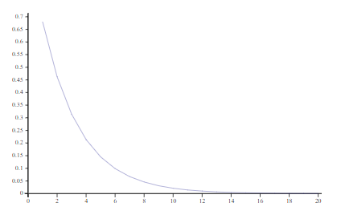

# APL Idioms & Solutions
Solutions of various problems in **Dyalog APL**  

**Note:** An overview of the most used APL symbols can be found in [this cheatsheet](https://awagga.github.io/dyalog/voc/).

## Resources
You can try most of the code below online at [Try APL](tryapl.org) or [ngn-apl](https://sohang3112.github.io/ngn-apl/).

## TODO
- Go through [this cheatsheet](https://github.com/ThePoetCoder/APL-to-NumPy/blob/main/APL%20to%20NumPy.ipynb) for translating between Numpy (Python) and APL
- [This Python code](https://stackoverflow.com/a/43331484/12947681) calculates Precision, Recall, Sensitivity, etc. Understand thoroughly (develop intuition) and translate to APL.

### Web Books
- [Mastering Dyalog APL](https://mastering.dyalog.com)
- [Learn APL](https://xpqz.github.io/learnapl)
- [APL Cultivations](https://xpqz.github.io/cultivations) is another good book (by the same author)

### Lists of Resources
- [Discord: APL Resources](https://discord.com/channels/821509511977762827/821511868744728647)
- [Discord: APL Recommendations](https://discord.com/channels/821509511977762827/915731546160386099)
- [APL News](https://apl.news/)

### Neural Networks
- [YouTube Series: Learn APL with Neural Networks](https://www.youtube.com/playlist?list=PLgTqamKi1MS3p-O0QAgjv5vt4NY5OgpiM)
- [Research Paper: Conventional Neural Networks with APL](https://dl.acm.org/doi/10.1145/3315454.3329960) - see its complete code in [its Github repo](https://github.com/ashinkarov/cnn-in-apl)

## TODO
- Study the Power Operator `⍣` operator as a (possible) replacement for `while` loop.

## Workspaces
- `⎕CY 'dfns'` is equivalent to `from dfns import *` in Python - i.e., import everything unqualified from given workspace.
- [Dfns Workspace](https://aplwiki.com/wiki/Dfns_workspace) is built-in, has many useful functions.
```
⎕CY 'dfns'   ⍝ Import built-in workspace 'dfns'
2 pco 30     ⍝ Prime Factorization of 30, using 'pco' function from 'dfns'
```    

## Benchmarking / Profiling
- `]PERFORMANCE.runtime '10?10'` - measure execution time of the code (which is written in a string)
- `⎕AI` - gives compute time since start of APL session (along with other information)
- `∘.(=×⊢)⍨⍳N` is ~200x slower than `A ← N N⍴0 ⋄ A[,⍨¨⍳N] ← ⍳N` for creating a [Diagonal Matrix](https://en.wikipedia.org/wiki/Diagonal_matrix) for `N←1000` - I measured this with `]PERFORMANCE.runtime`!

## Basic Idioms
- `!` (*Monadic:* Factorial, *Dyadic:* `nCr`):
```apl
!5      ⍝ 120 - Factorial of 5
3!5     ⍝ nCr (n=5, r=3) <- No. of combinations of r units from total n units
```
- `⍷` (Dyadic only) - Finds starting positions of substring in string. Example:
```apl
'issi' ⍷ 'Missisipi'   ⍝ 0 1 0 0 1 0 0 0 0 0
```
- `↑` (**Dyadic**: Take first N elems, **Monadic**: Mix / converts a vector of vectors to a single matrix of scalars)
```apl
⍝ If we try to take more elements than size of argument, then rest are padded with 0s
5↑1 4        ⍝ 1 4 0 0 0
```
- `⍕` (**Dyadic**: Format / Round) right argument to N decimal places, where N is left argument. If N=0, then this is same as finding nearest integer to number.

### User Defined Functions
- Create a `dfn` style function that takes inputs: right argument `⍵`, and optionally left argument `⍺`.
- An **ambivalent function** can be called monadically (with one argument) or dyadically (with 2 arguments).
One way to define ambivalent function is [a dfn with default left argument](https://xpqz.github.io/learnapl/functions.html?highlight=dfn#default-left-argument):
```apl
f ← {⍺←0 ⋄ ⍺ ⍵}    ⍝ ⍺ has default value 0
f 2                ⍝ monadic (one argument) use             
1 f 2              ⍝ dyadic (2 arguments) use
```

### Matrix
- [Laminate (comma with fractional axis)](https://mastering.dyalog.com/Working-on-Data-Shape.html) can:
    - Join vectors into matrix as rows - `A,[0.5]B`
    - Join vectors into matrix as columns - `A,[1.5]B`
    - Also works for higher dimensions (see link).

### String Functions
- `⊢⊂⍨1,' '∘=` - function to split string into words
- `+/∘.=` - Letter frequencies of some characters (left argument) in a string (right argument) (similar to Python's `collections.Counter` class):

### Complex Numbers
```
a ← 1j2    ⍝ Complex No. (Real = 1, Imaginary = 2)
9○a        ⍝ Get Real Part
11○a       ⍝ Get Imaginary Part

⍝ Monadic × gives sign of real numbers, but does something different with complex numbers: 
×3J4       ⍝ 0.6J0.8 - complex number with same phase but magnitude 1
```
This is the [Circle Operator](https://help.dyalog.com/18.2/Content/Language/Symbols/Circle.htm), which can be used to perform these and other trignometric operations.

**Note:** 
- Passing a negative number as left argument gives inverse of ordinary function (eg. sine becomes inverse sine). 
- **Example:** `11○a` gives imaginary component of `a`, so `¯11○a` "puts back" real `a` into imaginary component. In other words, `¯11○a` is the same as multiplying `a` with iota `0J1`.

### Date & Time
See the [reference](https://dfns.dyalog.com/n_Dates.htm).

```
 ⎕CY'dfns'                ⍝ load workspace dfns (built-in)
 ⎕TS timestamp 'Now'      ⍝ get current timestamp, and format it
 ```

 #### Time of Day
 ```
 Text  ← 'night' 'evening' 'afternoon' 'morning'
 Hours ← 19 18 12    ⍝ starting hours corresponding to the times of day in above variable Text
                     ⍝ starting hour (0) of morning is omitted because it is not required
 timeOfDay ← ⊃Text⌷⍨(1⍳⍨Hours≤⊢)   ⍝ function that takes hour (0-23) as input, returns string (time of day)
 ```
 
### Algebra
- Primary Diagonal of a Matrix - `1 1∘⍉`

- Sum of Vector Magnitudes - `.5+.*⍨2+.*⍨⊢`
     where (single) argument is a 2D Matrix whose each row is one vector.

- Solve System of Linear Equations - `(⌹⊢)+.×⊣` (uses Matrix Inverse Operator `⌹`)
    - right argument is coefficient matrix
    - left argument is vector of equation constants

- Function to evaluate a polynomial at a value - `⊤⍣¯1` where:
    - right argument is an array of coefficients of polynomial (highest power to lowest (constant) power)
    - left argument is value at which polynomial is to be evaluated. 

- Function to compare two arrays by priority - `×1↑0,⍨(0~⍨-)`, i.e.,
   first compare first elements, then second elements, and so on until the arrays diverge.
   The result is `1` (Left > Right), `¯1` (Left < Right) or `0` (Left = Right).
   
- `{∘.(=×⍵⌷⍨⊢)⍨⍳≢⍵}` - function to create [diagonal matrix](https://en.wikipedia.org/wiki/Diagonal_matrix) using array

- $sin(x)$ using Taylor expansion $x - x^3/3! + x^5/5! - x^7/7! ...$
```apl
⎕IO ← 0
sin ← {⍺←100 ⋄ (⍺⍴1 ¯1)+.×(!÷⍨⍵∘*)1+2×⍳⍺}
sin 0          ⍝ example - sin(0)
100 sin ○.5    ⍝ example - sin(pi/2) using 100 values of Taylor expansion
```
**Note:** This works in [ngn-apl](https://sohang3112.github.io/ngn-apl/) but raises `DOMAIN ERROR` in Dyalog APL.

### Computer Network
- Hemming Distance - `+.(|-)` 
     - Number of bits where two binary sequences differ. 

### Statistics - APL Functions
**Note:** Unless otherwise noted, the inputs to all listed functions are 1-D Arrays.

#### Monadic (Single Argument) Functions
- Frequency Count - `{⍺ (≢⍵)}⌸` (returns 2D matrix whose first column is unique elements, and second column is their frequencies)
    - See explanation for Key Operator ⌸ [here](https://xpqz.github.io/learnapl/key.html).
- Arithmetic Mean / Average - `avg ← +/÷≢`
- Running Average - `+\÷(⍳≢)`
- Geometric Mean - `gmean ← ×/*(÷≢)`
- Harmonic Mean - `hmean ← {÷+/÷⍵}×≢`
- Variance - `var ← (2+.*⍨⊢-avg)÷¯1+≢`
- Standard Deviation / RMS (Root Mean Square) - `stddev ← .5*⍨var`

#### Dyadic (Two Argument) Functions
**Note:** Each function below has left argument Frequencies, right argument Data. Both arguments are 1-D arrays.

- Inner Product / Weighted Mean / Arithmetic Mean for Sample Proportions - `ip ← +.×`
- Variance for Sample Proportions - `varsample ← +.× ∘ ((2*⍨⊢-avg)⊢)`
- Sigmoid Function - `sigmoid ← {÷1+*-⍵÷⍺}`
     - Right Argument `⍵` is actual input
     - Left Argument `⍺` is called **Temperature** (just a mathematical term!)
- [Pearson Correlation Coefficient](https://byjus.com/jee/correlation-coefficient/) - `correlation ← (+.×÷0.5*⍨×⍥(+/*∘2))⍥(⊢-+/÷≢)

### Operators (Higher Order Functions) - take functions as argument
- Stochastic / Probability Function - `{(?0⍴⍨⍵)≥⍺⍺⍳⍵}` - output 1 or 0 with probability given by Probability Function `⍺⍺` (input)
   - **Example** - `10∘sigmoid{(?0⍴⍨⍵)≥⍺⍺⍳⍵}10`

## Plotting / Graphing
- `]plot` - plots a vector on Y Axis, index on X Axis. Plot is continous by default.
- **Example** - Plot sigmoid function with 100 data points - `]plot sigmoid ⍳100`

### Stochastic / Probabilistic Plots
- [Random Walk](https://en.wikipedia.org/wiki/Random_walk)
```apl
N ← 1000                               ⍝ no. of data points. Plot becomes more detailed with increased N
random_walk ← {⍵+|+\⍺,0.5-?N⍴0}        ⍝ ⍵ ← minimum stock value (≥ 0), ⍺ ← initial investment
]plot 47 random_walk 0.5
```
**Note:** `N` (global variable) controls the no. of data points in the plot. Plot becomes more detailed with increased `N`.


- Random Walk with Upward Drift
```apl
N ← 10000                          ⍝ Very detailed plot
D ← 0.01                           ⍝ drift per day
]plot (D*⍳N) + 0 random_walk 0.5
```


## File I/O
- [Parsing Files - Text, CSV, XML, HTTP](https://xpqz.github.io/learnapl/io.html)
- Change Working Directory - `]CD 'directory-path-here'`
- [JSON (detailed)](https://xpqz.github.io/learnapl/io.html#reading-json-json)


## Misc

### Functions
- Calcuating tax according to tax slabs:
```apl
tax_calculate ← {(⍺[;2]÷100)+.×2-/⍵,⍺[;1]}      

⍝ This line means: >Rs. 10L => 35% Tax, >Rs. 7L => 20% Tax, >Rs. 5L => 35% Tax, >Rs. 0L => 0% Tax
M ← ↑(10 35) (7 20) (5 15) (0 0)           ⍝ Left column of matrix is in Rs. Lakhs, second column is Tax %
X ← 100                                    ⍝ Rs. Lakhs
M tax_calculate X                          ⍝ Returns: 32.4 (Rs. Lakhs)
```
- Number of times sorting directions (ascending or descending) change in a 1D array: `≢0~⍨2-/⊢`
- Format complex number as its real and imaginary parts seperated by a space - `⊃9 11(⊣,' ',⊢)⍥⍕.○⊢`
    - **Example:** `1j¯2` becomes the string `'1 ¯2'`.
- Add random noise to an array - `⊢+∘?0⍴⍨≢` (**Note:** Here, *random noise* means a random number between 0 and 1 is added to each element of array.)
- FizzBuzz function (array upto given argument) - `{⊃(1+2⊥0=5 3|⍵)⌷⍵ 'Fizz' 'Buzz' 'FizzBuzz'}¨⍳`
- Swastika Symbol - `' -|'[1+3∘.((0 2∊⍨-⍨)×(1+2|⊣))⍥⍳5]       ⍝ 3 5⍴'| |   - -   | |'`
- `{((⊢<¯1∘↑)+\⍵)/⍵}` - function that takes a boolean array and strips the last 1 (followed by all 0s)
- `↑(⊢,2∘*)⊂-⍳10` - table of negative powers of 2
- `N←50 ⋄ A←N N⍴' ' ⋄ A[(⌈N×9 11,.○⊢)¨*0j1×○(⍳N-1)÷2×N] ← '*' ⋄ A` - Prints an approximate quarter circle in a 50x50 grid.
- `A,[0.5]'-'` - Underlines string `A` using [Laminate](#matrix).
- Function that shows number spiral:
```
    spiral  ← {A ← ⍵ ⍵⍴' ' ⋄ B ← ¯1↓(9 11,.○⊢)¨+\(1j1×1+⌊⍵÷2),(⊃(⍴∘1¨2/⍳),.×1 0J1 ¯1 0J¯1⍴⍨2∘×)⍵-1 ⋄ A[B] ← 2 0∘⍕¨⍳≢B ⋄ A}
    spiral 5
 20  19  18  17 
  7   6   5  16 
  8   1   4  15 
  9   2   3  14 
 10  11  12  13 
```
- Function that puts boundary around matrix (right argument) using character (left argument):
```
       bounded ← {A←(2+s←⍴⍵)⍴⍺ ⋄ A[1+⍳s]←⍵ ⋄ A}
      '#' bounded ?4 3⍴10
#  # #  # #
# 10 5  9 #
#  4 2 10 #
#  3 8  9 #a
#  3 3  6 #
#  # #  # #
```

### Real Life Problems
- Suppose we collect data on `N` characterstics of a large group of people. What is the probability that a person exists who falls within 1 Standard Deviation from Average for all characterstics?

To find out, let's tabulate probabilities using `N` from 1 to 20:
```
       (⊢,[1.5](0.68∘*))⍳20       
 1 0.68           
 2 0.4624         
 3 0.314432       
 4 0.21381376     
 5 0.1453933568   
 6 0.09886748262  
 7 0.06722988818  
 8 0.04571632397  
 9 0.0310871003   
10 0.0211392282   
11 0.01437467518  
12 0.00977477912  
13 0.006646849802 
14 0.004519857865 
15 0.003073503348 
16 0.002089982277 
17 0.001421187948 
18 0.0009664078048
19 0.0006571573073
20 0.000446866969 
```

Or plot the probabilities as a graph: `]plot 0.68*⍳20`  


It's clear from both the table and the graph that the probability of the average person (who falls within 1 Standard Deviation in all charactestics) existing becomes very low as the no. of characterstics `N` increases.

In other words, **the average person doesn't exist!**

## Untested
- `(⎕NEW 'Bitmap' (⊂'File' 'image-filename')).CBits` - Read an image's bitmap. Doesn't work on Linux. Supposed to work on Windows, but haven't tested it yet.
